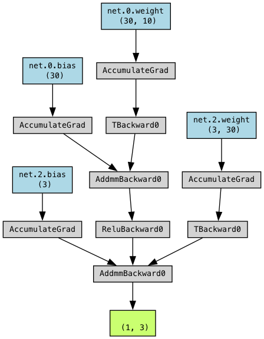

# AI_Pong_Game
Self-learning Pong AI in Python.


# AI Pong Game

A small experimental Pong AI project built with Python and Pygame.

The purpose of the project is to explore how a simple AI agent can improve its behavior over time through reward-based learning and repeated training. The project includes different training ideas such as focused replay after missed balls, adaptive rewards, and live visualization of training progress.

The project was mainly created as a learning and experimentation environment for:
- game AI
- reinforcement-learning inspired systems
- reward shaping
- neural network visualization
- training analysis

The implementation is intentionally kept relatively simple and readable in order to make experimentation easier.

---

## Features

- Pong game simulation
- AI-controlled paddle
- Reward-based training system
- Focused training on missed scenarios
- Live training statistics and graphs
- Neural network visualization
- Adjustable training parameters
- Real-time gameplay rendering using Pygame

---

## Technologies

- Python
- Pygame
- NumPy
- Matplotlib

---

## Training Approach

The AI receives rewards for successful interactions and penalties for missed actions. Different reward strategies can be tested and adjusted in order to observe how learning behavior changes over time.

The project also includes a “train on miss” mode where difficult situations can be repeated multiple times to improve learning stability.

---

## Running the Project

Install dependencies:

```bash
pip install pygame numpy matplotlib
```

Run the project:

```bash
python3 main.py
```

---

## Project Goal

The goal of the project is not to create a perfect AI system, but rather to explore and better understand:
- training behavior
- learning stability
- reward balancing
- iterative improvement in simple environments

---

## Screenshots

Add screenshots or GIFs here.

Example:

```md

```

---

## Repository Structure

```text
data/
models/
training/
main.py
game_objects.py
utils.py
Visual.py
config.py
```

---

## Notes

This project is experimental and still under development. The implementation and training strategies continue to evolve over time as new ideas are tested.
